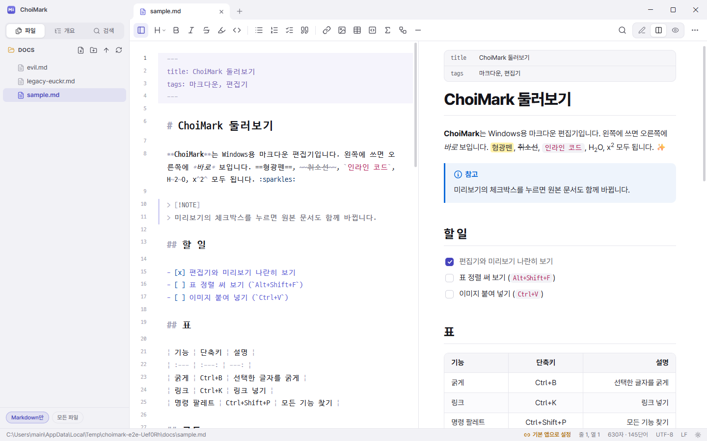

# ChoiMark

Windows 10/11용 마크다운 편집기와 실시간 미리보기. 설치하면 `.md`를 비롯한 Markdown 파일이 모두 ChoiMark로 열립니다.



## 설치

[Releases](https://github.com/choidevhi/choimark/releases)에서 `ChoiMark-1.0.0-setup.exe`를 받아 실행하세요. 관리자 권한 없이 현재 사용자에게 설치합니다.

- 시작 메뉴 바로 가기와 Windows의 **설치된 앱** 제거 항목을 만듭니다.
- WebView2가 없는 PC(일부 Windows 10)에는 설치 중에 함께 설치합니다.
- `.md` `.markdown` `.mdown` `.mkd` `.mkdn` `.mdwn` `.mdtxt` `.mdtext`를 ChoiMark에 연결합니다. 다른 앱을 "항상 이 앱으로 열기"로 골라 두었던 선택은 설치기가 지웁니다.
- 탐색기의 오른쪽 클릭 **새로 만들기** 메뉴에 **Markdown 문서**가 생깁니다.
- 제거하면 ChoiMark가 등록한 연결과 메뉴 항목도 지웁니다.

### Markdown 파일 연결

| Windows | 결과 |
| --- | --- |
| Windows 10, Windows 11 Enterprise·Education | 설치만 하면 모든 Markdown 파일이 ChoiMark로 열립니다. |
| Windows 11 Home·Pro (2025년 업데이트 이후) | 형식마다 처음 한 번 Windows가 묻습니다. `.md`를 처음 열 때 뜨는 **앱 선택** 창에서 ChoiMark를 고르고 **항상**을 누르세요. |

Windows 11 Home·Pro는 2025년부터 "항상 이 앱으로 열기" 선택을 새 서명(UserChoiceLatest)으로 검사합니다. 이 서명 방식은 공개되지 않았고, 앱이 대신 고르는 길을 Windows가 막아 두었습니다. 설치기는 그 밖의 모든 준비(기본 클래스, 연결 후보, 이전 선택 정리, Windows 10용 서명 선택)를 마쳐 두므로 남는 것은 그 한 번의 확인입니다. 앱 안의 **설정 → 파일 · 연결 → ChoiMark로 열기**를 누르면 Windows 설정의 ChoiMark 페이지가 바로 열립니다.

## 기능

**편집기**
- CodeMirror 6 기반: 다중 커서, 찾기·바꾸기(정규식), 줄 이동, 코드 접기, 괄호 자동 닫기
- 제목·굵게·코드·인용·표·front matter를 편집기 안에서도 구분해 보여 줌
- 목록에서 Enter를 누르면 다음 항목 기호가 자동으로 붙음
- 표 정렬(Alt+Shift+F): 한글을 두 칸으로 계산해 D2Coding 글꼴에서 반듯하게 맞춤
- 이미지 붙여넣기(Ctrl+V): 문서 옆 `assets` 폴더에 저장하고 링크를 넣음
- URL을 선택한 글자 위에 붙여 넣으면 링크가 됨

**미리보기**
- GitHub 스타일(GFM): 표, 할 일 목록, 취소선, 자동 링크, 각주, 알림 상자(`> [!NOTE]`)
- 수식(KaTeX, `$…$` `$$…$$`), 다이어그램(Mermaid), 코드 강조(주요 언어 40여 개)와 복사 버튼
- 형광펜(`==…==`), 아래·위 첨자, 정의 목록, 이모지(`:smile:`), YAML front matter 표
- 체크박스를 누르면 원본 문서가 바뀜. 미리보기를 두 번 누르면 그 줄로 이동
- 편집기와 스크롤 동기화

**파일**
- 탭, 파일 트리, 문서 개요(목차), 폴더 안 모든 문서 검색, 빠른 열기(Ctrl+P), 명령 팔레트(Ctrl+Shift+P)
- UTF-8·UTF-8 BOM·UTF-16·EUC-KR(CP949) 자동 인식, 원래 인코딩과 줄 끝(CRLF/LF)을 그대로 저장
- 다른 프로그램이 파일을 바꾸면 자동으로 다시 불러옴(저장하지 않은 내용이 있으면 물어봄)
- 저장은 임시 파일에 쓴 뒤 교체해서, 저장 중 문제가 생겨도 원본이 반쯤 지워지지 않음
- HTML 내보내기, PDF 저장(인쇄), 서식 있는 텍스트로 복사(블로그·메일에 붙여넣기)
- 밝은/어두운 테마, 집중 모드(F11), 자동 저장, 시작할 때 탭 복원

## 자주 쓰는 단축키

| 키 | 기능 |
| --- | --- |
| Ctrl+N / Ctrl+O / Ctrl+S | 새 문서 / 열기 / 저장 |
| Ctrl+P | 빠른 열기 |
| Ctrl+Shift+P | 명령 팔레트 |
| Ctrl+B / Ctrl+I / Ctrl+K | 굵게 / 기울임 / 링크 |
| Ctrl+1 … Ctrl+6, Ctrl+0 | 제목 수준, 본문 |
| Ctrl+Shift+7 / 8 / 9 | 번호 / 글머리 / 할 일 목록 |
| Ctrl+Enter | 할 일 체크 |
| Ctrl+T, Alt+Shift+F | 표 넣기, 표 정렬 |
| Ctrl+Alt+1 / 2 / 3 | 편집 / 분할 / 미리보기 |
| Ctrl+Shift+F | 폴더에서 찾기 |

전체 목록은 설정 → 단축키에 있습니다.

## 보안

문서는 믿을 수 없는 입력으로 다룹니다. 문서 안의 HTML은 DOMPurify로 정리하고(스크립트·이벤트 처리기·iframe 제거), 앱 화면에는 외부 스크립트를 막는 CSP를 겁니다. 문서의 링크로 실행 파일(.exe, .bat, .ps1 등)을 열 수 없습니다. 앱 창은 앱 페이지 밖으로 이동하지 않습니다.

## 개발

필요한 것: Node 24 + corepack, Rust(stable, MSVC), Visual Studio C++ Build Tools.

```powershell
corepack pnpm install
corepack pnpm tauri dev                     # 개발 실행
corepack pnpm test                          # 단위 테스트 (Vitest)
cd src-tauri; cargo test                    # Rust 테스트
corepack pnpm tauri build --debug --no-bundle
node scripts/e2e.mjs                        # 실제 앱을 띄워 끝까지 검사, 스크린샷은 _shots\
corepack pnpm tauri build                   # 설치 파일: src-tauri\target\release\bundle\nsis\
```

아이콘은 `python scripts/make_icons.py` 후 `corepack pnpm tauri icon src-tauri/icons/app-icon.png`로 다시 만듭니다.

구성: Tauri 2(Rust) + WebView2, React 19, CodeMirror 6, markdown-it, KaTeX, Mermaid, highlight.js, DOMPurify. 설치기는 NSIS이며 연결 처리는 `src-tauri/windows/hooks.nsh`와 `src-tauri/src/assoc.rs`에 있습니다.

## 라이선스

ChoiMark 코드는 [MIT](LICENSE)입니다. 함께 들어 있는 글꼴과 라이브러리의 라이선스는 [THIRD_PARTY.md](THIRD_PARTY.md)에 있습니다.
