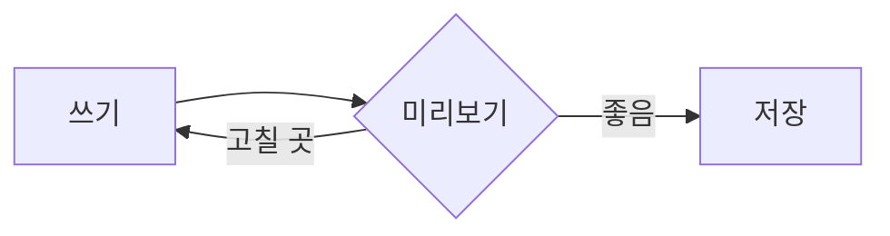

# ChoiMark 둘러보기

**ChoiMark**는 Windows용 마크다운 편집기입니다. 왼쪽에 쓰면 오른쪽에 *바로* 보입니다. ==형광펜==, ~~취소선~~, `인라인 코드`, H~2~O, x^2^ 모두 됩니다. :sparkles:

> [!NOTE]
> 미리보기의 체크박스를 누르면 원본 문서도 함께 바뀝니다.

## 할 일

- [x] 편집기와 미리보기 나란히 보기
- [ ] 표 정렬 써 보기 (`Alt+Shift+F`)
- [ ] 이미지 붙여 넣기 (`Ctrl+V`)

## 표

| 기능 | 단축키 | 설명 |
| :--- | :---: | ---: |
| 굵게 | Ctrl+B | 선택한 글자를 굵게 |
| 링크 | Ctrl+K | 링크 넣기 |
| 명령 팔레트 | Ctrl+Shift+P | 모든 기능 찾기 |

## 코드

```ts
export function greet(name: string): string {
  // 이름을 받아 인사합니다
  return `안녕하세요, ${name}님!`;
}
```

## 수식

질량-에너지 등가: $E = mc^2$

$$
\int_{0}^{\infty} e^{-x^2}\,dx = \frac{\sqrt{\pi}}{2}
$$

## 다이어그램



## 인용과 각주

> 좋은 글은 좋은 도구에서 나온다.

각주도 됩니다.[^1]

[^1]: 각주 내용은 문서 맨 아래에 모입니다.
